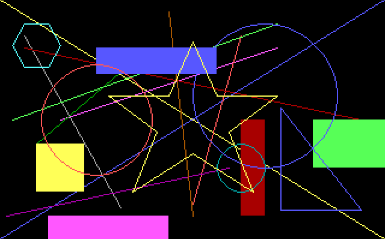

# Graphics in x86 assembly
16 bit x86 assembly program which draw primitive shapes onto the screen by writing directly to VGA memory in video mode 13h. 

## Key features
* Stack frame implementation for functions
* Writing directly to video memory
* Graphics functions
    * Pixel
    * Rectangle
    * Circle
    * Polygon (n-sided)

## Example image
